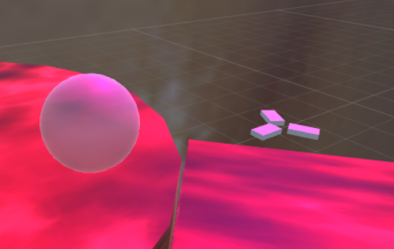
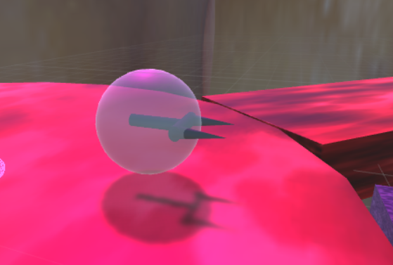
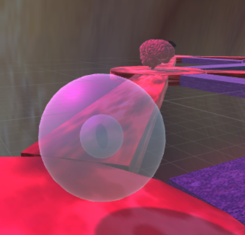
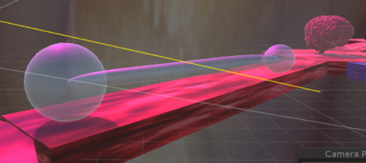
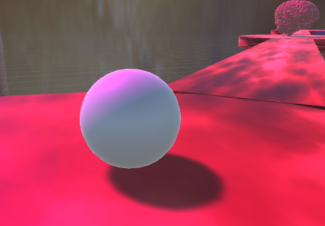
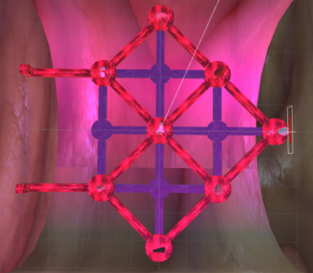
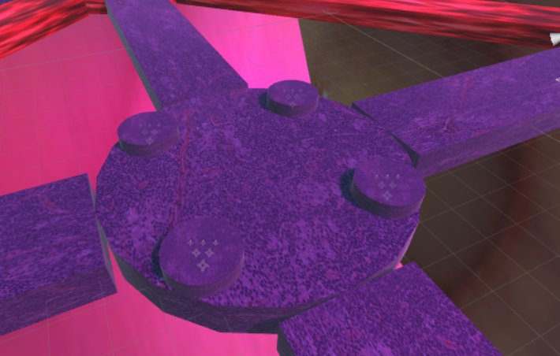
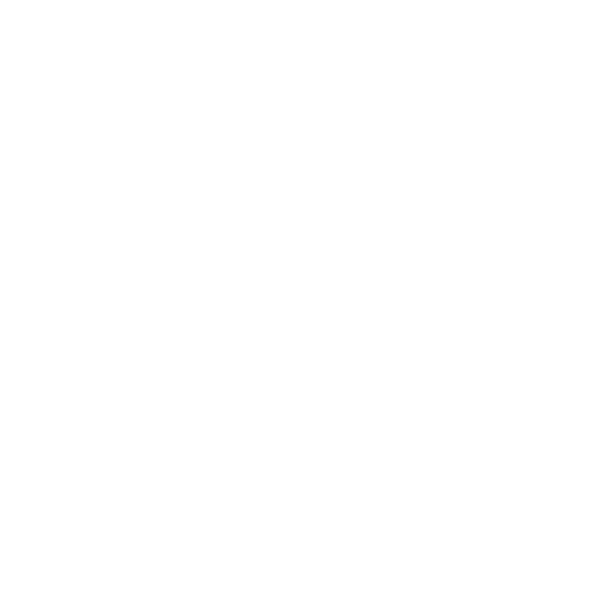

# Immune War
## Overview
My thesis project is a game which combines tower defense game with first person shooter. It is about how immune cells fight with pathogens like bacterias and virus in human's body. I used Unity3D engine to build it. 
## Background
There was a very popular cartoon in 2018 called Cells at Work. It is the stories between the cells in a human body. All characters in this cartoon are personification. For example, the red blood cells are transport workers, they deliver oxygen to organs and send back carbon dioxide to lung. The white blood cells are soldiers, they are aggressive and strong, kill the invading enemies from outside world. The story of this cartoon is very attractive, and people could learn a lot of biology knowledge from it. I find I can make a very interesting combat game.
I considered focusing on immune system, because many biological characteristics in immune system could be used as fighting factors in a game. There are four main immune cells, B cell, T cell, Macrophage and Neutrophil. They have very distinctive features with each other. For B cell, it could "blow" the antibody into the fluid, so it can damage the pathogens further than other immune cells. For T cell, especially the killer T, it is the most destructive immune cell in human body, but it is only good at short distance attack. For Macrophage, it is the biggest immune cell, and it is omnivorous, almost eat anything, even the "garbage" inside the blood vessels. It can extend part of his body to surround the pathogen and digest them. However, for specific bacteria or virus, its attack force is not as good as B and T. And Neutrophil is the weakest immune cell among the other three, but the number of it is the most in the blood. However, when it attack pathogens, it will be died.
## My Characters
After knowing these background knowledge, I was inspired to make these four immune cells as my game's roles. 
### B Cell
B Cell can shoot antibody to the air. When the antibody to the air, it is like a Y character, which is the abstract feature of real antibody. When the antibody collide with pathogen, it will cause some damage to pathogen. The antibody stops and explodes only when it is hit with something.  
    
### T Cell
It has a fork inside the body, when it meet an antibody, it will stab the fork into the enemy's body to cause a huge damage. In the real world in may looks like the picture, kind like full of forks on the surface of cell.  
  
### Macrophage
Double size of B Cell and T Cell, it could also extend a part of his body like picture to catch the small pathogen. It just like a hook, to throw forward to catch a prey and pull back to get it. When it gets the pathogen, it will eat it and help B fort to upgrade its ATK.  
  
  
### Neutrophil
The smallest one among the four immune cells. Just a white ball in my game. You can put it all most everywhere as a suicide guard. You can put multiple neutrophils at same time. And it will pounce on them when they see the pathogens.  
  
## Game Map
The game map of my game is created refer to the human blood system and lymphatic system. All of people know how important the blood system is, but lymphatic system also take a great part of human circulatory system. Without it, our organ cannot be protected by immune cells.  
  
So, my game map is consisting of two color roads. The red one represents blood system, and blue one represents lymphatic system. The Pathogens can only move on the blood roads.
I have four lymph glands represented by the blue round platform. You can see four table on it. It is the stage of B Cell Fort. The reason why I set 4 of it of each platform is because they can cover every blood road in their shooting rage.  
  
There is a magic circle near the players birth location. It is the position where we can set T cell fort.  
  
The pathogens have two ways to make an invasion, one is through stomach, the other is through lungs. Additionally, if they enter the organs of intestine, liver and pancrea and accumulate to four, it will duplicate one stronger pathogen. 
 
## Game Control
W,A,S,D as position moving, mouse moving as sight moving. press TAB to change immune cells, press q to set a Neutrophil, press e to set a B Cell Fort, press r to set a T Cell Fort. Click left button on mouse to attack. Press and hold m key to expand the minimap.  
## Play method
### Task
Try to eliminate as many pathogens as you can, keep them away from the spine (which is your birth point). If the spine's blood bar goes down to blank, the game is over, the player loses the game. If you defend the spine until the last wave of pathogens, you win the game. 
### Earn Immunity
The pathogens coming wave by wave, and each wave will be stronger than last one. The only way to defend is to set more forts and kill more pathogen, because that will earn more immunity, the immunity is just like the money. In other games, we buy fort or arms by money. In this game, it is immunity. What's more, the fort will be destroyed when it runs out immunity. But we could build a new one on the same position.
## Core Technology
### Physics & Collision
This game use large amount of physics collision functions. Including Raycast, OnCollsionEnter, OnTriggerEnter, OverlapShpere etc. The reason that I use Raycast is I need to aim at the position. My camera is float on the characters' head. That means what I am aiming at is not what my character aiming at. So, I need to make a ray hit on the point what the camera aiming and assign the position to the character. Without doing it. The "bullets" will go elsewhere. 
I also use Collision, Trigger and OverlapShpere to detect the enemies(pathogens) around fort. When the enemy steps into the area which overlap with fort's collider, we could use enter function to add the enemy into the enemy list and choose which enemy in the list the fort should attack. When the enemy go outside the range, we listen the Exit function to remove the enemy out the list. 
For the T cell fort, I create a sphere collider to help him decide when to stab its fork into the enemy. This is much better than distance function. Because different enemies have different size, so the T cell fort cannot guarantee the distance could damage the enemies.
### Navigation AI
The game uses the AI algorithm of obstacle avoidance navigation. The map has many crossings and turning. By using the Nav Mesh Agent component, I can set the destination point by point very easy. And it would avoid colliding on the obstacle. It suits my 3D tower defense game very well, so all my pathogens have these components.
Beside the pathogens need the function, the T Cell Fort and Neutrophil also need it. Because they need to get close to the pathogens and attack them automatically. So the best way to to let them track the pathogens is set a Nav Mesh Agent component.
### Minimap
At the beginning, the minimap is not in the game plane, but when I start to play on the game, without minimap, it is hard to figure out where I am and where are the enemies. So I add a orthographic camera above the map, and project it to a raw image. Set it to a UI in canvas. Additionally, I made a minimap icon, then it is clear to see where I am.
## Postmortem
It always has many bugs in the game. I solve most of them, but still some bugs I don't know how to figure out. For example, sometimes there are some enemies in the map, but it shows that it doesn't have any enemies in the scene. I don't know what cause the counter problem. However, I can realize I used too many broke data structure and format in my game. For example, I write too many singletons, and finally I find I don't need to do that. Also, there are too many unnecessary references and assignments. 
## Future
I would like to rewrite some classes to make the structure more clearly. Also, as a kind of tower defense game. I need to focus on the level design, especially how to use something like XML to persist each level's data. If I know how to do, I will make the enemies waves more randomly, like the enemy A and B could show together, and the speed of them is different. 
Furthermore, I am interested into make it as a VR game in HTC Vive platform. Try to make the models more real, and perhaps it could become an educational video game.
## Game Introduction Video
[Immune War](https://youtu.be/9Z0lEwg9t2M)  
## Download Game
[Windows](https://github.com/andydenost/Immune_War/tree/master/WindowsVersion)  
[Mac](https://github.com/andydenost/Immune_War/tree/master/MacVersion.app/Contents)  
## Source Code
[Thesis Project](https://github.com/andydenost/Immune_War/tree/master/Thesis_Project)  

